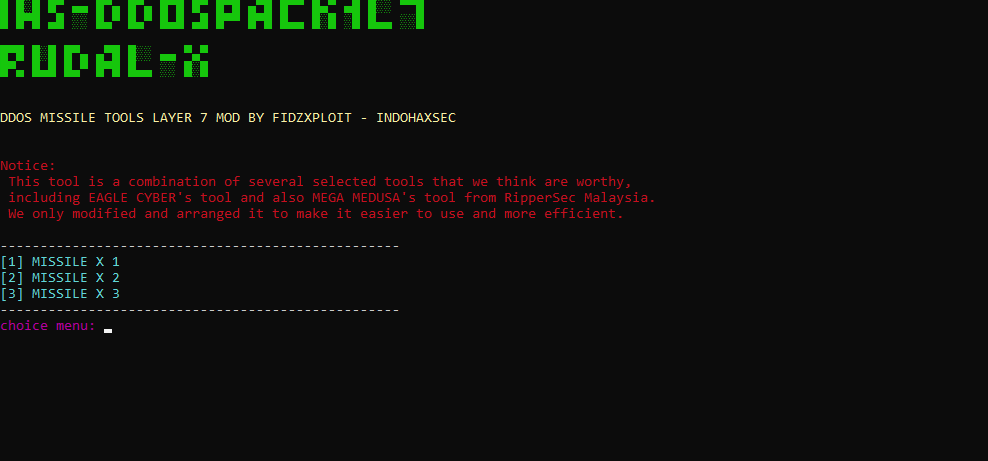

IHS-DDOS PACK1L7

Modified by FIDZXPLOIT from INDOHAXSEC Team

About:

IHS-DDOS PACK1L7

IHS-DDOS PACK1L7 is a versatile tool designed for network and web security testing. This tool is a combination of several selected tools that we believe are worthy, including EAGLE CYBER's tool and also MEGA MEDUSA's tool from RipperSec Malaysia. We have modified and arranged it to make it easier to use and more efficient for both professionals and beginners.

This tool integrates various Layer 7 DDoS scripts into one unified package, allowing users to easily access different attack methods through a simple menu interface.

Key Features

Menu-Based Interface:

Simple and intuitive navigation to select various types of attacks.

Combined Tools: 

Integrates the functionality of EAGLE CYBER and MEGA MEDUSA for powerful and reliable performance.

Efficient Modification:

The code has been restructured and optimized to reduce complexity and improve operational efficiency.

Compatibility:

Supports scripts written in Python 2, Python 3, and Node.js, providing flexibility in execution.

System Requirements

Before using this tool, ensure that your system has the following packages installed:

Python 3: The primary environment for running the main script.

Python 2: Required for executing scripts developed with Python 2 syntax.

Node.js: Required for running the JavaScript-based scripts.

requests: A Python library for making HTTP requests.

figlet: A library for generating ASCII art text.

Installation and Usage

Clone the Repository:

Bash

git clone https://github.com/IndoHaxSec/IHS-DDOS-PACK1L7.git

cd IHS-DDOS-PACK1L7

Install Dependencies:

Make sure you have all the system requirements listed above installed. You can install the Python libraries with these commands:

Bash

pip install requests

pip install figlet

Run the Tool:

Once all dependencies are installed, run the tool using the following command:

Bash

python start_missile.pyc

Important Warning

IHS-DDOS PACK1L7 is intended for legitimate security testing and educational purposes only. The use of this tool for illegal activities or without proper authorization is unlawful and is the sole responsibility of the user. The developers are not liable for any misuse of this tool.

Contributions

We welcome contributions from the community to improve this tool. If you find a bug or have an idea for a new feature, please open an issue or submit a pull request.
